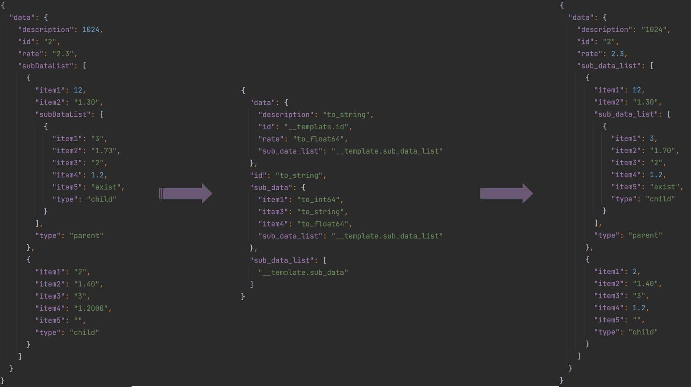

<h1 align="center">NormalizeJSON</h1>

<p align="center"><a align="center" href="https://godoc.org/github.com/Grivn/normalizejson"></img></a></p>

<p align="center"></img></p>

NormalizeJSON is a Go package that provides a simple way to normalize key-value pairs in a JSON document using a **template**.

This README is a quick overview of how to use NormalizeJSON.

## Getting Started

### Installing

```shell
go get -u github.com/Grivn/normalizejson@latest
```

go version >= 1.18

### Create Provider

To take use of NormalizeJSON, you should create a provider `FormatProvider`.

```go
package main

import (
	"fmt"
	"github.com/Grivn/normalizejson"
)

func main() {
	provider, err := normalizejson.NewFormatProvider(nil)
	if err != nil {
		panic(fmt.Errorf("[EXAMPLE] create normalizejson provider failed: %s", err))
	}
	provider.Reset()
}
```

### Initiate Provider

Then, you should initiate the provider with `options` and `template`.

#### Options

The `options` are used to normalize key-value pairs in a JSON document.

```go
package normalizejson

type FormatFuncType string

const (
	FormatFuncFormatData FormatFuncType = "format_function_type_format_data" // default type
	FormatFuncFormatKey                 = "format_function_type_format_key"
)

type FormatFunc func(item interface{}) (interface{}, error)

type FormatOption struct {
	FunctionType   FormatFuncType
	FunctionName   string
	FormatFunction FormatFunc
}
```

For each option, you should assign a `FormatFunc` to it.
This function will be used to normalize the keys or values in a JSON document.

There are two types of options in NormalizeJSON:

- `normalizejson.FormatFuncFormatKey` (key-option)
- `normalizejson.FormatFuncFormatData` (data-option)

The key-options are used to normalize the JSON keys.
Each key should be normalized by corresponding `FormatFunc` in the key-option.

The data-options are used to normalize the JSON values.
You should create a `template` to assign the normalization methods to the values.

You can create key-options and value-options using methods `normalizejson.FormatKeyOption` and `normalizejson.FormatDataOption` accordingly.

Here's an example of how you might initiate a provider with options.

- To create key-options. (convert JSON keys from camel-case to snake-case)

```go
var FormatKeyOptions = []normalizejson.FormatOption{
	normalizejson.FormatKeyOption(FormatCamelToSnake, FormatKeyCamelToSnake),
}

var regexCamelCaseJSONKey = regexp.MustCompile(`\"(\w+)\":`)

func FormatKeyCamelToSnake(item interface{}) (interface{}, error) {
	str, ok := item.(string)
	if !ok {
		return item, nil
	}
	return strings.ToLower(regexCamelCaseJSONKey.ReplaceAllString(str, `${1}_${2}`)), nil
}
```

- To create data-options. (functions named 'to_string', 'to_int64', 'to_float64', 'to_bool' to normalize JSON values)

```go
var FormatDataOptions = []normalizejson.FormatOption{
	normalizejson.FormatDataOption(FormatToInt64, FormatDataToInt64),
	normalizejson.FormatDataOption(FormatToFloat64, FormatDataToFloat64), 
	normalizejson.FormatDataOption(FormatToString, FormatDataToString), 
	normalizejson.FormatDataOption(FormatToBool, FormatDataToBool),
}

const (
	FormatToInt64   = "to_int64"
	FormatToFloat64 = "to_float64"
	FormatToString  = "to_string"
	FormatToBool    = "to_bool"
)

func FormatDataToString(item interface{}) (interface{}, error) {
	return cast.ToStringE(item)
}

func FormatDataToInt64(item interface{}) (interface{}, error) {
	return cast.ToInt64E(item)
}

func FormatDataToFloat64(item interface{}) (interface{}, error) {
	return cast.ToFloat64E(item)
}

func FormatDataToBool(item interface{}) (interface{}, error) {
	return cast.ToBoolE(item)
}
```

- To initiate a provider.

```go
package main

func main() {
	...

	options := append(FormatKeyOptions, FormatDataOptions...)
	provider.AddOptions(options...)
}
```

#### Template

To normalize values in a JSON document, you should create a template to state the function to use.

- Attention Please

  If you have initiated a provider with both key-option and data-option, we will normalize the key at first.

  It means that we will take the normalized key to find the value to process and the `FormatFunc` to invoke.

  So that, you should define the `template` with the expected key after the normalization.

For example, the `provider`'s options have been initiated according to example in the previous part. To normalize [input.json](example/input.json) to [output.json](example/output.json), you should create a template file [config.json](example/config.json). Here, we should convert the JSON key from camel-case to snake-case and format the values to the expected data type, such as `int64` to `string`.

input.json

{"data":{"description":1024,"id":"2","rate":"2.3","subDataList":[{"item1":12,"item2":"1.30","subDataList":[{"item1":"3","item2":"1.70","item3":"2","item4":1.2,"item5":"exist","type":"child"}],"type":"parent"},{"item1":"2","item2":"1.40","item3":"3","item4":"1.2000","item5":"","type":"child"}]}}
output.json

{"data":{"description":"1024","id":"2","rate":2.3,"sub_data_list":[{"item1":12,"item2":"1.30","sub_data_list":[{"item1":3,"item2":"1.70","item3":"2","item4":1.2,"item5":"exist","type":"child"}],"type":"parent"},{"item1":2,"item2":"1.40","item3":"3","item4":1.2,"item5":"","type":"child"}]}}
In our `template`, we have defined the function to be invoked for specific key's value.

config.json

```json
{
  "data": {
    "description": "to_string",
    "id": "__template.id",
    "rate": "to_float64",
    "sub_data_list": "__template.sub_data_list"
  },
  "id": "to_string",
  "sub_data": {
    "item1": "to_int64",
    "item3": "to_string",
    "item4": "to_float64",
    "sub_data_list": "__template.sub_data_list"
  },
  "sub_data_list": [
    "__template.sub_data"
  ]
}
```

This template file defines 4 templates, namely `data`, `id`, `sub_data`, and `sub_data_list`.

A key-value pair in a template file indicates the value of the corresponding key in the JSON document should be handled by the format function.

E.g.`{"data":{"description":"to_string"}}`

It means the value of `data.description` in the JSON file should be processed by `to_string` which is a `FormatFunc` from data-options.
There is a built-in function `__template.{{template_name}}`, which means processing the value with the template `{{template_name}}`.

E.g. `{"sub_data":{"sub_data_list":"__template.sub_data_list"}}`

It means the value of `sub_data.sub_data_list` should be processed by `sub_data_list` template.
In addition, an array in a JSON document is described by the statement like `["{{function_name}}"]`.
Each element in this array should be processed by the function `{{function_name}}`.

E.g. `{"sub_data_list":["__template.sub_data"]}` means the `sub_data_list` is an array.

Then, each value of the array should be processed by function called '__template.sub_data'.

And we should process each element of the array using the `sub_data` template.
To initiate the provider with `template`.

```go
func main() {
	...

	if err = provider.UpdateTemplate(template); err != nil {
		panic(err)
	}
}
```

### Normalize JSON Schema

To normalize the JSON schema, just input the raw JSON document into `FormatJSONSchema`, then you can get the normalizedJSON.

```go
func main() {
	...

	formattedJSON, err := provider.FormatJSONSchema(source)
	if err != nil {
		panic(err)
	}
}
```

## Example

The following shows a complete [example](example) about how to use NormalizeJSON,
which takes [template](example/config.json) to convert from the [input.json](example/input.json) to the [output.json](example/output.json).

```go
package main

import (
	"bytes"
	"encoding/json"
	"fmt"
	"os"
	"regexp"
	"strings"

	"github.com/Grivn/normalizejson"
	"github.com/spf13/cast"
)

func main() {
	provider, err := normalizejson.NewFormatProvider(nil)
	if err != nil {
		panic(fmt.Errorf("[EXAMPLE] create normalizejson provider failed: %s", err))
	}

	provider.Reset()

	options := append(FormatKeyOptions, FormatDataOptions...)
	provider.AddOptions(options...)

	source, err := os.ReadFile("input.json")
	if err != nil {
		panic(err)
	}

	template, err := os.ReadFile("config.json")
	if err != nil {
		panic(err)
	}

	if err = provider.UpdateTemplate(template); err != nil {
		panic(err)
	}

	formattedJSON, err := provider.FormatJSONSchema(source)
	if err != nil {
		panic(err)
	}

	if _, err = os.Create("output.json"); err != nil {
		panic(err)
	}

	var buf bytes.Buffer
	if err = json.Indent(&buf, formattedJSON, "", "  "); err != nil {
		panic(err)
	}

	if err = os.WriteFile("output.json", buf.Bytes(), 0777); err != nil {
		panic(err)
	}
}

const (
	FormatCamelToSnake = "camel_to_snake"
)

var FormatKeyOptions = []normalizejson.FormatOption{
	normalizejson.FormatKeyOption(FormatCamelToSnake, FormatKeyCamelToSnake),
}

var regexCamelCaseJSONKey = regexp.MustCompile(`(\w)([A-Z])`) // camel-case style

func FormatKeyCamelToSnake(item interface{}) (interface{}, error) {
	str, ok := item.(string)
	if !ok {
		return item, nil
	}
	return strings.ToLower(regexCamelCaseJSONKey.ReplaceAllString(str, `${1}_${2}`)), nil
}

var FormatDataOptions = []normalizejson.FormatOption{
	normalizejson.FormatDataOption(FormatToInt64, FormatDataToInt64),
	normalizejson.FormatDataOption(FormatToFloat64, FormatDataToFloat64),
	normalizejson.FormatDataOption(FormatToString, FormatDataToString),
	normalizejson.FormatDataOption(FormatToBool, FormatDataToBool),
}

const (
	FormatToInt64   = "to_int64"
	FormatToFloat64 = "to_float64"
	FormatToString  = "to_string"
	FormatToBool    = "to_bool"
)

func FormatDataToString(item interface{}) (interface{}, error) {
	return cast.ToStringE(item)
}

func FormatDataToInt64(item interface{}) (interface{}, error) {
	return cast.ToInt64E(item)
}

func FormatDataToFloat64(item interface{}) (interface{}, error) {
	return cast.ToFloat64E(item)
}

func FormatDataToBool(item interface{}) (interface{}, error) {
	return cast.ToBoolE(item)
}

func printJSON(raw []byte) {
	fmt.Println(string(formatJSON(raw)))
}

func formatJSON(raw []byte) []byte {
	formattedJSON, _ := removeJSONBlankAndBreak(raw)
	return formattedJSON
}

func removeJSONBlankAndBreak(raw []byte) ([]byte, error) {
	var item interface{}
	if err := json.Unmarshal(raw, &item); err != nil {
		return nil, err
	}
	return json.Marshal(item)
}
```

input.json

{"data":{"description":1024,"id":"2","rate":"2.3","subDataList":[{"item1":12,"item2":"1.30","subDataList":[{"item1":"3","item2":"1.70","item3":"2","item4":1.2,"item5":"exist","type":"child"}],"type":"parent"},{"item1":"2","item2":"1.40","item3":"3","item4":"1.2000","item5":"","type":"child"}]}}
config.json

{"data":{"description":"to_string","id":"__template.id","rate":"to_float64","sub_data_list":"__template.sub_data_list"},"id":"to_string","sub_data":{"item1":"to_int64","item3":"to_string","item4":"to_float64","sub_data_list":"__template.sub_data_list"},"sub_data_list":["__template.sub_data"]}

## TOOLs

You can refer to [Toolkits](TOOLKITs.md) to find some useful toolkits to process JSON schema.
